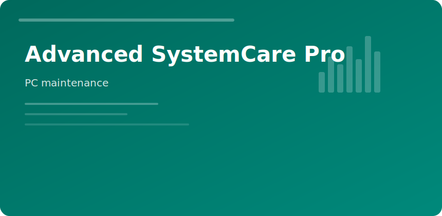

  

  

# Advanced SystemCare Pro

Maintenance dashboard for PCs that accumulate **temp clutter**, **stale startups**, and **browser detritus**.

### Modules

| Module | Action |
|--------|--------|
| AI Scan | junk + shortcuts + registry noise |
| Turbo Boost | RAM trim, background throttling |
| Software Updater | patch stale runtimes |
| Privacy Sweep | cache, cookies, logs |

### Safe use

Review quarantine before deleting; exclude dev folders from "large file" cleanup.

### Pro vs free

Real-time tune-up, deeper registry clean, and scheduled automation.

advanced systemcare pro iobit optimizer cleanup windows maintenance
